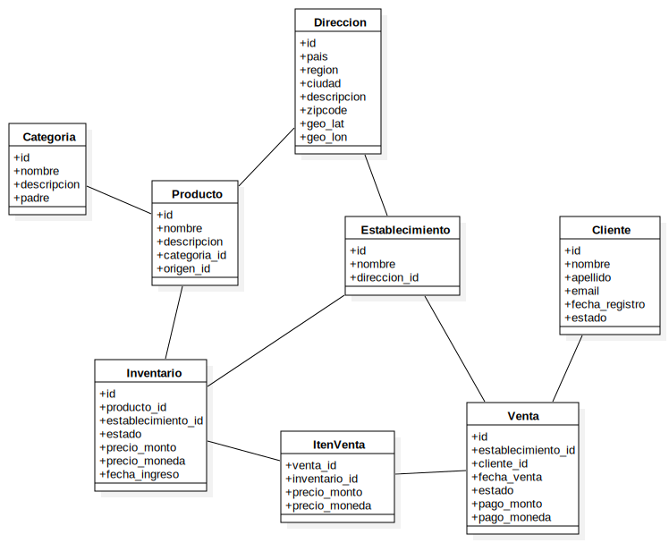
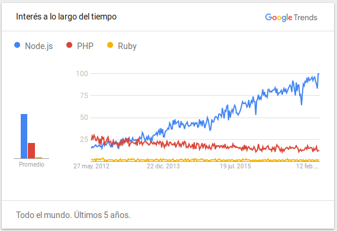
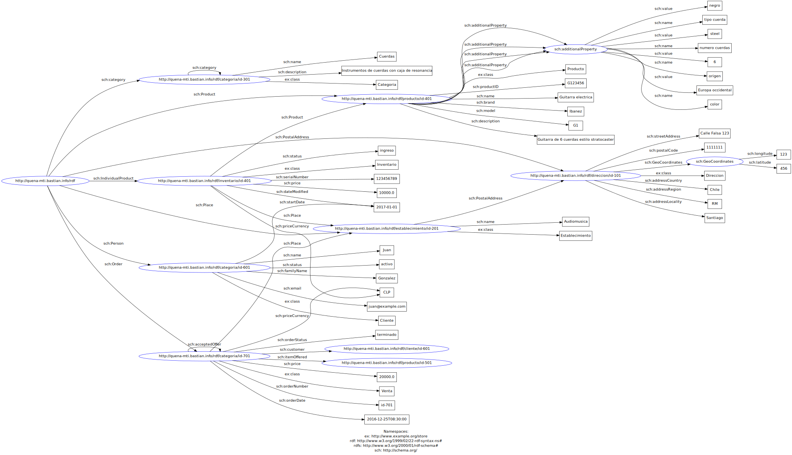
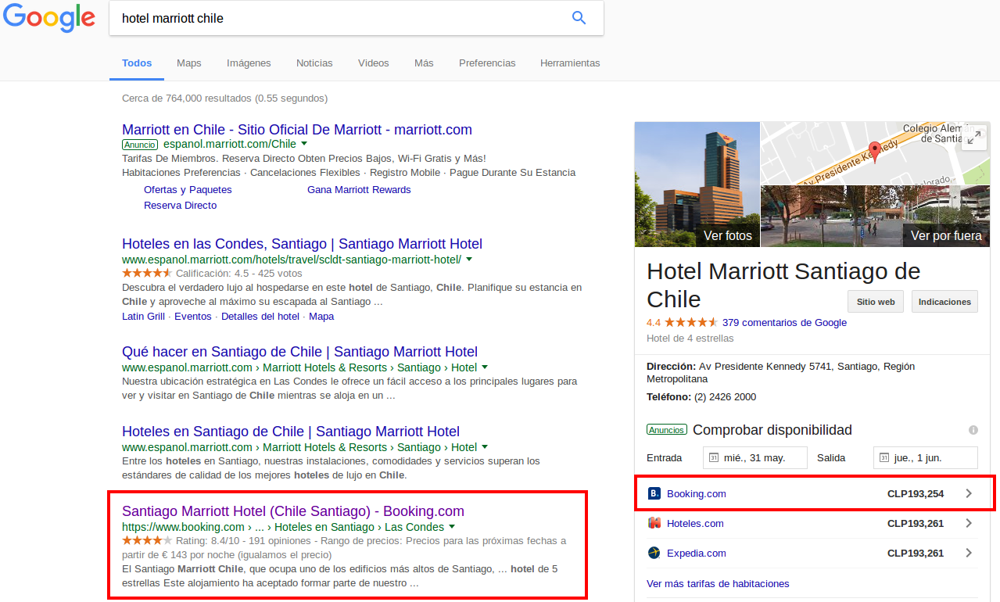

Bastian Carvajal Y

bastian.carvajal@sansano.usm.cl


## Enunciado

“Se desea desarrollar la infraestructura de un portal Web de compra/venta de instrumentos musicales llamado QUENA. El portal dispone de una serie de establecimientos asociados repartidos a nivel mundial así como productos de dichas regiones que se desea vender a través de Internet. El portal Web gestionará la información de cada establecimiento así como los productos disponibles en cada una de ellos.”

Las tareas a realizar serán:

1. Representación de la información. 

  1.1. Representar la información de los establecimientos, los productos y sus características, precios, disponibilidad, etc. en ficheros XML y JSON. No es necesario representar toda la información en un único fichero XML/Json, si no que pueden utilizarse varios.
  
  1.2. Crear vocabularios mediante DTD, XML Schema para validar los ficheros XML de la sección anterior. Opcionalmente, crear ficheros JSON Schema para validar la representación Json.
  
  1.3. Realizar una comparación entre el formato XML y el formato JSON, indicando las ventajas e inconvenientes de cada uno de ellos. Incluir una comparación entre las capacidades expresivas de los lenguajes de esquema para XML y los lenguajes de esquema para JSON.

2. Aplicación Web. 

  2.1. Crear un servicio Web REST para gestionar la información de los establecimientos, así como de los productos disponibles.

  2.2. El servicio Web deberá devolver la información de los establecimientos en los formatos XML, JSON y HTML. Puede realizarse mediante URIs diferentes o mediante negociación de contenido. Documentar brevemente el servicio Web creado, los métodos y la forma de invocarlos (se recomienda la utilización de Swagger para la documentación). Crear una aplicación Web cliente del servicio Web anterior.

  2.3. Realizar una valoración de la solución comparando el framework NodeJs con otros frameworks Web. Analizar posibles soluciones para desplegar el sistema desarrollado: servidores locales, servidores en la nube, microservicios, etc. teniendo en cuenta diversos aspectos: precio, disponibilidad, escalabilidad, etc.

3. Web Semántica

  3.1. Representar la información de establecimientos y productos musicales de la primer tarea en formato RDF. Opcionalmente, se podrá utilizar ShEx o SHACL para validar los ficheros creados (una posible herramienta sería para la validación sería RDFShape o Shaclex).

  3.2. Existen 2 tecnologías que permiten incorporar metadatos en páginas Web: microdatos y RDFa. Enriquecer las páginas Web de establecimientos y productos musicales con microdatos ó con RDFa para que sus contenidos puedan ser indexados por buscadores. Utilizar para ello elementos del vocabulario Schema.org.

  3.3. Analizar la solución presentada, así como las ventajas e inconvenientes de enriquecer portales Web con tecnologías semánticas. Este análisis puede llevarse a cabo utilizando uno o más casos de uso propuestos por los estudiantes. Se valorarán casos de uso reales o en los que los estudiantes tengan experiencia previa.


## Desarrollo

A continuación se presenta el desarrollo de cada una de las tareas antes mencionadas. En algunos casos se hace referencia a archivos externos, estos se entregan adjuntos a este documento y también estarán disponibles en un repositorio de github. 

Este documento y todo el código fuente generado para este proyecto puede encontrarse en la siguiente dirección: https://github.com/bastiancy/quena-mti


#### 1.1 y 1.2 

Para representar la información de establecimientos, productos, etc., se realizo el siguiente diagrama de clases.



La representacion en **xml** se divide en dos archivos, el primero incluye la definicion del **dtd** para validar el documento, y el seguno que tiene separado el archivo **xsd** para validar a traves de **xml schema**:

- dtd
  - [parte1/xml/store1.xml](parte1/xml/store1.xml)
- xml schema
  - [parte1/xml/store2.xml](parte1/xml/store2.xml)
  - [parte1/xml/store2.xsd](parte1/xml/store2.xsd)

Para validar estos archivos se utiliza `xmllint` en un entorno linux. Los siguientes comandos se pueden ejecutar en el directorio `/parte1/xml/`.

```
# Es válido si no retorna ningun mensaje.
xmllint --valid store1.xml --noout

# Es válido si retorna "store2.xml validates"
xmllint --schema store2.xsd --noout store2.xml

```

La representacion en **json** tiene algunas variaciones respecto de la anterior. Igualmente se valida a traves de **json schema**.

- [parte1/json/store.json](parte1/json/store.json)
- [parte1/json/store.schema.json](parte1/json/store.schema.json)

Se creo un script en **nodejs** para validar este archivo. Los siguientes comandos se pueden ejecutar en el directorio `/parte1/json/`.

```
# instalar dependencias (probado con node v4.8.1 y npm v4.4.4)
npm install

# Es válido si no retorna ningun mensaje.
node validator.js store.json store.schema.json

```


#### 1.3

Ambos formatos XML y JSON han sido utilizados extensivamente para el intercambio de informacion en Internet. Especialmente en web services, donde la tendencia en este ultimo tiempo ha sido generar APIs mas simples, donde algunos desarrolladores prefieren JSON para el intercambio de datos.

En XML (del ingles _eXtensible Markup Language_, o traducido como _Lenguaje de marcado extensible_) la  intencion es tomar _texto plano_ y agregar "marcado" para crear un texto estructurado. Este meta-lenguaje (derivado del SGML) nacio en IBM por la necesidad de estructurar documentos grandes, almacenando los datos en forma legible, para poder ser compartidos con otros SO.

En cambio, JSON fue diseñado para serializar datos en JavaScript, de aqui su nombre "_JavaScript Object Notation_". Es por esta razon que ha sido naturalmente aceptado por  desarrolladores web.

Una de las mayores diferencias es que XML soporta _mixed content_, es decir, permite mezclar etiquetas de nodos dentro de _strings_ literales, por ejemplo:

```xml
<p>An <b>inline tag</b> in the text!</p>
```

Mientras que JSON no soporta esta caracteristica; en JavScript un string literal no es interpretado por el compilador. De la misma forma, JSON tampoco soporta etiquetas para agregar comentarios como en XML, esto fue de hecho una decision de diseño, como lo ha expresado Douglas Crockford:

> I removed comments from JSON because I saw people were using them to hold parsing directives, a practice which would have destroyed interoperability.

Respecto de la validacion de documentos con JSON Schema o XML Schema, en ambos casos es posible definir reglas acerca de los tipos de datos soportados, y la estructura a la que el documento debe apegarse. Comparten en escencia las mismas ventajas y desventajas desde el punto de vista de su sintaxis, ya que se definen en JSON y XML respectivamente.

Algunas de estas ventajas e inconvenientes son:

**JSON**

- Ventajas:
    - Sintaxis mas reducida, ya que no necesita de etiquetas especiales para definir los nodos.
    - Facil integracion con JavaScript puesto que es la forma de serializar los objetos, de aqui su nombre "_JavaScript Object Notation_".
    - Puede usar _JSON Schema_ para la descripcion y validacion de los tipos de datos y la estructura del documento.
    - Puede usar _JsonPath_ para la extraccion de informacion en estructuras profundamente anidadas.
- Desventajas:
    - Estructura no es autodescriptiva y soporta pocos tipos de datos diferentes.
    - No permite agregar comentarios en el documento.
    - No soporta el uso de _namespaces_.

**XML**

- Ventajas:
    - Su sintaxis se basa en etiquetas para definir cada nodo, lo que permite representar estructuras diferentes en el mismo documento.
    - Los nodos pueden ser auto descriptivos al definir propiedades en la etiqueta.
    - Se pueden agregar comentarios al documento.
    - Puede usar _XML Schema_ o _DTDs_ para validacion de datos y estructura.
    - Se puede usar _XSLT_ para transformar a diferentes formatos de salida.
    - Puede usar _XPath/XQuery_ para informacion en estructuras profundamente anidadas.
    - Soporte includo de _namespaces_.
- Desventajas:
    - Sintaxis mas compleja o mas _verbose_ (las etiquetas se repiten al cierre del nodo). Los documentos temrinan usando mas datos para la misma cantidad de informacion.
    - Puede ser menos legible para un humano en estructuras anidadas.
    - Puede ser más lento de interpretar por un compilador, y no tiene soporte nativo en JavaScript.


#### 2.1 y 2.2 

El servicio REST ha sido desarrollado en **nodejs**, y utiliza **MongoDB** (base de datos no relacional) para la persistencia de datos. El api ha sido documentada con **swagger**, lo cual permite interactuar con ella desde el mismo navegador (usando `swagger-ui`). 

Esta api implementa _negociacion de contenido_ y puede servir los siguientes formatos: **json**, **xml**, **html**. Esta solo consume datos en **json**. Se puede acceder publicamente en las siguientes URLs:

 - API: [http://api.quenamti.bastianc.info/](http://api.quenamti.bastianc.info/)
 - Documentacion: [http://api.quenamti.bastianc.info/docs/](http://api.quenamti.bastianc.info/docs/)

Tambien se ha desarrollado un cliente para consumir el API antes mencionada, este cliente consiste en una _SPA_ (single page application) construida sobre **AngularJs 2**. Y contiene una pequeña administracion para editar parte de la informacion de productos y establecimientos. Tambien se puede acceder publicamente y no requiere de autenticacion.

 - Acceso publico: [http://quenamti.bastianc.info/](http://quenamti.bastianc.info/)
 - Administracion: [http://quenamti.bastianc.info/admin/categorias](http://quenamti.bastianc.info/admin/categorias)

Esta aplicacion no tiene implementados todos los recursos expuestos por la api, por lo que es mejor probarla a traves de la documentacion online.


#### 2.3

**Node.js** es un runtime para ejecutar JavaScript del lado del servidor, el cual esta basado en el motor V8 de Gooogle, y en una arquitectura orientada a eventos. El runtime de Node.js es _single-threaded_, es decir que se ejecuta en un único hilo de proceso. Este hilo es compartido entre conexiones, permitiendo manejar un elevado numero de conexiones concurrentes, ya que todas las llamadas de IO (por ejemplo acceso al disco o a la red) son asíncronas. Estas llamadas se consideran _non-blocking_, lo que significa que la ejecucion de JavaScript no se detiene a esperar a que termine dicho proceso externo (leer un archivo del disco), sino que es procesado posteriormente por un _callback_.

Como se describe en su sitio oficial: "_As an asynchronous event driven JavaScript runtime, Node is designed to build scalable network applications_". Su utilidad en la construccion de aplicaciones escalables esta dada por su capacidad de manejar muchas conexiones concurrentes de forma eficiente. Es similar a herramientas como _Twisted_ en Python, y ha sido diseñado especialmente para el _streaming_ sobre HTTP con bajas latencias. Esto lo hace especialmente apto para servir APIs, o soportar aplicaciones web _real-time_.

Existen varios frameworks basados en Node.js para desarrollar aplicaciones web, como _Express_, _Hapi_, or _Sails_. Es aquí donde se pueden hacer comparaciones con otras plataformas, como _Rails_ en el caso de _Ruby_, _Django_ para Python, o _Laravel_ en PHP. Todas estas plataformas tienen sus propios ecositemas, y en muchos casos una gran comunidad que aporta a estos proyectos que son en su mayoria _open source_. Pero Node.js no se queda atras, ya que aun cuando es de las plataformas menos maduras, se ha convertido en una de las mas populares.



Respecto del ejercicio anterior cabe señalar que, gracias a la gran cantidad de paquetes disponibles en el ecosistema de NodeJS, ha sido relativamente simple crear el API de la tienda virtual Quena. Usando **npm** es muy simple gestionar estas dependencias, ya que  nos provee de una forma rápida de instalar estos paquetes, y nos ayuda a mantener las versiones correctas para cuidar la compatibilidad con la aplicacion.

En la aplicacion se utiliza el framework **Express**, el cual nos permite crear un servidor web completamente funcional en no mas de 50 líneas de código. Tambien, para persistir los datos en _MongoDB_ se utiliza **Mongoose**, libreria que nos abstrae de los detalles de la conexion a la base de datos y nos provee de una sencilla interfaz para crear el modelo. En terminos generales esta solucion parece mucho mas sencilla y liviana, a diferencia de otros frameworks como Rails, donde se requiere de mucha configuracion para lograr el mismo resultado.

Por otro lado, es importante analizar las altenativas para desplegar aplicaciones basadas en NodeJs. Al ser una herramienta multiplataforma se puede instalar en distintos sistemas operativos, en algunos casos exiten paquetes de sistemas listos para instalar NodeJs, como en Debian o Centos. Ademas NodeJs puede gestionar directamente un puerto TCP para recibir conexiones, lo que elimina la necesidad de un web server adicional como por ejemplo Apache.

Ademas de desplegar la aplicacion en servidores propios existen varias alternativas, como servicios cloud. A continuacion algunos ejemplos y sus caracteristicas.

__Amazon Web Services__

_Amazon Web Services_ (AWS) permite hacer deploy de una aplicacion web en Node.js de alta disponibilidad, usando el servicio _AWS Elastic Beanstalk_. Este es un sistema de contenedores el cual hace extremadamente sencillo subir aplicaciones empaquetadas a AWS  como _Platform as a Service_ (PaaS). Se tiene completo control sobre el servidor en el cual corre la aplicacion, y de hecho se pueden correr multiples aplicaciones en el servidor sin incurrir en costos adicionales.

  - Ventajas: Variadas ofertas de planes, ademas de amplio soporte en forma de foros y buena  docuemtacion.
  - Desventajas: Una curva de aprendizaje muy pronunciada cuando se trata de AWS, especialmente para aquellos que nunca lo han utilizado antes, y aún más para aquellos que nunca han sido responsables de la administración de su propio servidor antes.
  
__Heroku__

Inicialmente sólo soportando a Ruby on Rails, Heroku ha añadido soporte para una amplia gama de lenguajes y entornos incluyendo Perl, Python, PHP, Java y por supuesto Node.js. Propiedad de Salesforce.com, Heroku también ofrece una integración perfecta con una gran cantidad de servicios de terceros (como SendGrid y Redis) y permite el despliegue en varias regiones.

  - Ventajas: Heroku ofrece un nivel gratuito, y es muy fácil de empezar (incluso para los desarrolladores principiantes). Hay una gran documentación de soporte disponible de forma gratuita y una extensa lista de complementos y servicios que se pueden agregar de forma instantánea.
  - Desventajas: Una vez que dejas el nivel libre, Heroku empieza a ser bastante caro muy rápidamente. Además, mientras que comenzar con Heroku es rápido, las aplicaciones más grandes tienden a conducir a despliegues más lentos.

__AppFog__

Con una interfaz de usuario super intuitiva, una potente línea de comandos y la API REST para una implementación robusta, AppFog tiene muchísimo que hacer. La oferta PaaS permite alojar fácilmente aplicaciones Node.js en la nube, con despliegue relativamente rápido y escalabilidad automática.

  - Ventajas: AppFog ofrece soporte profesional de 24 horas para todos los usuarios y tiene una sencilla utilidad de línea de comandos. Nivel gratuito para 2 GB de memoria y 100 MB de almacenamiento.
  - Desventajas: Aunque el proceso de despliegue es generalmente sencillo con AppFog, el inconveniente es que no siempre es tan rápido como muchos quisieran. Si bien esto está bien si sólo está desplegando una vez al día o semana, para despliegues más regulares es posible que se desee un poco más de velocidad.

__Microsoft Azure__

_Microsoft Azure_ es la plataforma basada en la nube de Microsoft que permite a los desarrolladores crear, desplegar y administrar rápidamente potentes sitios web y aplicaciones web. Se trata de una plataforma fiable con gran flexibilidad y alta disponibilidad en múltiples regiones. Con soporte para máquinas Windows y Linux, puede monitorear todas las aplicaciones Node.js alojadas en Azure en tiempo real, con soportade a escalabilidad automática.

  - Ventajas: Un buen plan gratuito que le permite alojar hasta 10 aplicaciones en cada centro de datos. También es muy fácil escalar la aplicación Node.js hacia arriba o hacia abajo en Azure, o simplemente habilitar la escala automática para permitir que Azure pueda escalar de acuerdo con el tráfico.
  - Desventajas: Los despliegues pueden ser lentos y no hay forma de desplegar a Azure desde un Mac.


#### 3.1

En este caso se han reutilizado los arhivos XML generados en el primer ejercicio, pero siendo adaptados para cumplir con el estandar **XML/RDF v1**. El archivo se generó en base a una plantilla XLST, especialmente adaptada al archivo original.

 - xml original: [parte1/xml/store2.xml](parte1/xml/store2.xml)
 - plantilla xsl: [parte1/rdf/store.xls](parte1/rdf/store.xls)
 - archivo resultante (xml/rdf): [parte1/rdf/store.rdf.xml](parte1/rdf/store.rdf.xml)
 
Tambien se ha generado una version en formato **RDF/Turrle** del documento anterior. 

 - rdf/turtle: [parte1/rdf/store.rdf.tt](parte1/rdf/store.rdf.tt)

El siguiente digrama muestra el grafo que se desprende de la especificacion en el archivo rdf/turle.



Los archivos antes mencionados se validaron utilizado algunos script en **nodejs**, tambien especialmente diseñados para este ejercicio. Por esta razon se deben instalar algunas dependencias (`npm install`) en la carpeta `parte1/rdf/`.

```
# Es válido si no retorna ningun mensaje.
node validate.js store.rdf.tt text/turtle

# Es válido si no retorna ningun mensaje.
node validate.js store.rdf.xml application/rdf+xml

```


#### 3.2

En la aplicacion Quena se ha implementado **RDFa 1.1 Lite** para agregar metadatos. Se ha utilizado _schema.org_ principalmente para definir las propiedades.

Se validaron estas paginas con la herramienta online "RDFa 1.1 Distiller and Parser" de la _W3C_. En este caso se valido la página de productos del API, en el siguiente link se muestran los resultados:

[https://www.w3.org/2012/pyRdfa/extract?uri=http%3A%2F%2Fapi.quenamti.bastianc.info%2Fproductos&rdfa_lite=true&vocab_expansion=false&embedded_rdf=true&validate=yes&space_preserve=true&vocab_cache_report=false&vocab_cache_bypass=false](https://www.w3.org/2012/pyRdfa/extract?uri=http%3A%2F%2Fapi.quenamti.bastianc.info%2Fproductos&rdfa_lite=true&vocab_expansion=false&embedded_rdf=true&validate=yes&space_preserve=true&vocab_cache_report=false&vocab_cache_bypass=false)

A continuacion se presenta un extracto del html generado y el documento RDF que se genero en formato Turtle

```html
<!DOCTYPE html>
<html>
<head>
	<title></title>
</head>
<body>
	<h3>Productos</h3><br>
	<ul typeof="schema:Thing">
		<li>
			<a href="/productos/590f9d24e7fe09009866f3ad">id: <span property="schema:identifier">590f9d24e7fe09009866f3ad</span></a>
		</li>
		<li>nombre: <span property="schema:name">Quena</span></li>
		<li>descripcion: <span property="schema:description">La quena (del quechua qina) es un instrumento de viento...</span></li>
	</ul><br>
	<ul typeof="schema:Thing">
		<li>
			<a href="/productos/590f9dafe7fe09009866f3b3">id: <span property="schema:identifier">590f9dafe7fe09009866f3b3</span></a>
		</li>
		<li>nombre: <span property="schema:name">Zampoña</span></li>
		<li>descripcion: <span property="schema:description">La zampoña es un instrumento de viento...</span></li>
	</ul><br>
	<ul typeof="schema:Thing">
		<li>
			<a href="/productos/590f9dc7e7fe09009866f3b9">id: <span property="schema:identifier">590f9dc7e7fe09009866f3b9</span></a>
		</li>
		<li>nombre: <span property="schema:name">Charango</span></li>
		<li>descripcion: <span property="schema:description">El charango es un instrumento de cuerda...</span></li>
	</ul><br>
	<ul typeof="schema:Thing">
		<li>
			<a href="/productos/590f9dd4e7fe09009866f3bf">id: <span property="schema:identifier">590f9dd4e7fe09009866f3bf</span></a>
		</li>
		<li>nombre: <span property="schema:name">Gaita</span></li>
		<li>descripcion: <span property="schema:description">La gaita o cornamusa1 es un instrumento de viento...</span></li>
	</ul>
</body>
</html>
```

```
@prefix schema: <http://schema.org/> .

<http://api.quenamti.bastianc.info/productos/590f9d24e7fe09009866f3ad> schema:identifier "590f9d24e7fe09009866f3ad" .

<http://api.quenamti.bastianc.info/productos/590f9dafe7fe09009866f3b3> schema:identifier "590f9dafe7fe09009866f3b3" .

<http://api.quenamti.bastianc.info/productos/590f9dc7e7fe09009866f3b9> schema:identifier "590f9dc7e7fe09009866f3b9" .

<http://api.quenamti.bastianc.info/productos/590f9dd4e7fe09009866f3bf> schema:identifier "590f9dd4e7fe09009866f3bf" .

[] a schema:Thing;
 schema:description "La zampoña es un instrumento de viento..." .

[] a schema:Thing;
 schema:description "El charango es un instrumento de cuerda....";
 schema:name "Charango" .

[] a schema:Thing;
 schema:description "La quena (del quechua qina) es un instrumento de viento....";
 schema:name "Quena" .

[] a schema:Thing;
 schema:description "La gaita o cornamusa1 es un instrumento de viento.. .
```

Puesto que la aplicacion cliente fue desarrollada como una _SPA_ (single page application), todo el html es generado de forma dinámica con JavaScript. Esto supone  un problema para el validador el cual no puede procesar JavaScript, sino que extrae directamente el documento HTML que entrega el servidor. Por esta razon se validó  contra el API, donde se devuelve por defecto documentos en HTML.
 

#### 3.3

Muchos sitios se generan a partir de datos estructurados, que a menudo se almacenan en bases de datos. Cuando estos datos se formatean en HTML, resulta muy difícil recuperar los datos estructurados originales. Muchas aplicaciones, especialmente los motores de búsqueda, pueden beneficiarse enormemente del acceso directo a estos datos estructurados. El marcado en página permite a los motores de búsqueda comprender la información de las páginas web y proporcionar resultados de búsqueda más ricos para facilitar a los usuarios la búsqueda de información relevante en la Web. Para esto se usan modelos como _Microdatos_ y _RDFa_.

En el ejercicio anterior se utilizo **RDFa**, especificamente la recomendacion _RDFa 1.1 Lite_ de la _W3C_, a modo de enriquecer los documetos HTML. La ventaja de _RDFa Lite_ es que se hace muy simple su implementacion, puesto que es un subconjunto de _RDFa 1.1_ (RDFa-core) que contiene solo cinco atributos: `vocab`, `typeof`, `property`, `resource` y `prefix`. RDFa Lite es tambien completamente compatible con RDFa-core, donde solo es necesario agregar el resto de atributos para generar estructuras de datos mas complejas.

Como se ha dicho antes, la ventaja de agregar datos estructurados a los documentos HTML es que otras herramientas (que podrían ser robots de búsqueda, clientes, complementos de navegador, CMS, etc.) puedan entender el contexto de estos datos. Un caso practico es el de Google Search, que provee de _"Rich Snippets"_ como una forma de mejorar los resultados de busqueda. _Rich snippets_ consiste en un cuadro que representa visualmente la informacion de los resultados de busqueda en el sitio de Google, y que generalmente aparece mas destacados que los otros resultados. 

Una de las posibles desventajas es que aún cuando se pueden crear vocabularios propios, es mejor seguir convenciones como los de **schema.org**. Ademas el implementar estas propiedades a las etiquetas requiere de modificar la aplicacion original, lo que puede significar mayores costos y esfuerzo por parte del equipo de desarrollo.

**booking.com**

Un caso de uso que se analizó es el sitio **http://www.booking.com**, donde se ha dado soporte a RDFa y OGP (facebook open graph). Este portal permite buscar y reservar hoteles en todo el mundo, incluso permite pagar la reserva online usando tarjera de credito. 
  
Al buscar en google la frase "hotel marriott chile" aparece entre los primeros resultados el sitio de booking.com, donde se indica la valoracion, cantidad de comentario, e incluso el rango de precios del hotel.



Como ejercicio se validó esta pagina particular de booking.com y se genero el siguiente documento RDF en formato Turtle:
 
```
@prefix fb: <http://ogp.me/ns/fb#> .
@prefix ns1: <http://www.w3.org/1999/xhtml/vocab#> .
@prefix ns2: <http://ogp.me/ns#image:> .
@prefix ns3: <al:android:> .
@prefix ns4: <al:ios:> .
@prefix ns5: <http://www.w3.org/ns/rdfa#> .
@prefix ns6: <http://ogp.me/ns/fb/booking_com#location:> .
@prefix ns7: <wb:> .
@prefix ns8: <http://schema.org/> .
@prefix og2: <http://ogp.me/ns#> .

<https://www.booking.com/hotel/cl/marriott-stgo.es.html> ns3:app_name "Booking.com Hotel Reservation"@es;
 ns3:package "com.booking"@es;
 ns3:url "booking://hotel/92228?affiliate_id=375119"@es;
 ns4:app_name "Booking.com Hotel Reservations"@es;
 ns4:app_store_id "367003839"@es;
 ns4:url "booking://hotel/92228?affiliate_id=375119"@es;
 og2:description "El Santiago Marriott Chile, que ocupa uno de los edificios más altos de Santiago, está situado a solo 300 metros del centro comercial Mall Parque Arauco."@es;
 og2:image "https://t-ec.bstatic.com/images/hotel/max300/349/34910545.jpg"@es;
 ns2:height "208"@es;
 ns2:width "300"@es;
 og2:locale "es"@es;
 og2:site_name "Booking.com"@es;
 og2:title "★★★★★ Santiago Marriott Hotel, Santiago, Chile"@es;
 og2:type "booking_com:hotel"@es;
 og2:url "https://www.booking.com/hotel/cl/marriott-stgo.es.html"@es;
 fb:app_id "145362478954725"@es;
 ns6:latitude ""@es;
 ns6:longitude ""@es;
 ns5:usesVocabulary ns8:;
 ns7:webmaster "48970bbca45d28c2"@es .

<https://www.booking.com/hotel/cl/marriott-stgo.es.html#footertopnav> ns1:role ns1:navigation .

<https://www.booking.com/hotel/cl/marriott-stgo.es.html#frm> ns1:role ns1:search .

<https://www.booking.com/hotel/cl/marriott-stgo.es.html#hotelpage_availform> ns1:role ns1:form .

<https://www.booking.com/hotel/cl/marriott-stgo.es.html#left> ns1:role ns1:complementary .

<https://www.booking.com/hotel/cl/marriott-stgo.es.html#right> ns1:role ns1:main .

<https://www.booking.com/hotel/cl/marriott-stgo.es.html#top> ns1:role ns1:banner .

<https://www.booking.com/city/cl/santiago.es.html?4mbcrumb=1> a ns8:WebPage .

<https://www.booking.com/country/cl.es.html?4mbcrumb=1> a ns8:WebPage .

<https://www.booking.com/district/cl/santiago/lascondes.es.html?4mbcrumb=1> a ns8:WebPage .

<https://www.booking.com/index.es.html?4mbcrumb=1> a ns8:WebPage .

<https://www.booking.com/region/cl/metropolitana.es.html?4mbcrumb=1> a ns8:WebPage .

[] ns1:role ns1:navigation .

[] ns1:role ns1:navigation .

[] ns1:role ns1:navigation .

[] ns1:role ns1:alert .

[] a ns8:BreadcrumbList;
 ns8:itemListElement [ a ns8:ListItem;
         ns8:item <https://www.booking.com/region/cl/metropolitana.es.html?4mbcrumb=1>;
         ns8:name "Región Metropolitana"@es;
         ns8:position "3"@es ],
     [ a ns8:ListItem;
         ns8:item <https://www.booking.com/district/cl/santiago/lascondes.es.html?4mbcrumb=1>;
         ns8:name "Las Condes"@es;
         ns8:position "5"@es ],
     [ a ns8:ListItem;
         ns8:item <https://www.booking.com/country/cl.es.html?4mbcrumb=1>;
         ns8:name "Chile"@es;
         ns8:position "2"@es ],
     [ a ns8:ListItem;
         ns8:name "Santiago Marriott Hotel"@es;
         ns8:position "6"@es ],
     [ a ns8:ListItem;
         ns8:item <https://www.booking.com/index.es.html?4mbcrumb=1>;
         ns8:name "Booking.com"@es;
         ns8:position "1"@es ],
     [ a ns8:ListItem;
         ns8:item <https://www.booking.com/city/cl/santiago.es.html?4mbcrumb=1>;
         ns8:name "Hoteles en Santiago"@es;
         ns8:position "4"@es ] .

[] ns1:role ns1:navigation .

[] ns1:role ns1:alert .

[] ns1:role ns1:navigation .

[] ns1:role ns1:tooltip .
```

 En este caso se puede apreciar que se utilizaron varios vocabularios, como _schema.org_, y _facebook open graph_, para describir distintos aspectos del sitio. Como por ejemplo, la navegacion por el sitio y los detalles de este hotel, o la valoracion en base a los comentarios de los clientes.
 
Se puede concluir entonces que agregar datos estructurados a los sitios favorece el  descubrimiento de esta informacion en internet. Permite que otras herramientas puedan analizar estos datos, y de cara al usuario hacer mas accesible dicha informacion.  Sin embargo, tambien significa un esfuerzo adicional para desarrollo de estas aplicaciones web.
