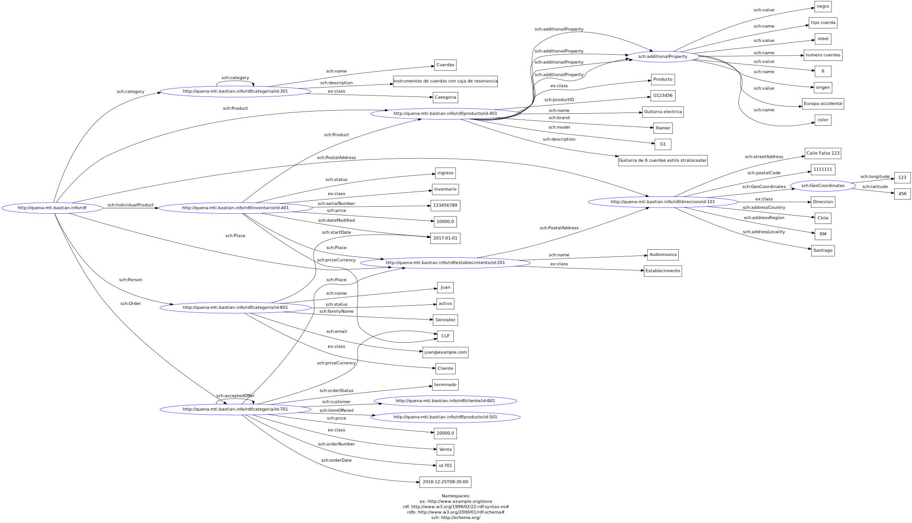

MTI 2016 
Bastian Carvajal Y
bastian.carvajal@sansano.usm.cl


## Enunciado

“Se desea desarrollar la infraestructura de un portal Web de compra/venta de instrumentos musicales llamado QUENA. El portal dispone de una serie de establecimientos asociados repartidos a nivel mundial así como productos de dichas regiones que se desea vender a través de Internet. El portal Web gestionará la información de cada establecimiento así como los productos disponibles en cada una de ellos.”

Las tareas a realizar serán:

1. Representación de la información. 

  1.1. Representar la información de los establecimientos, los productos y sus características, precios, disponibilidad, etc. en ficheros XML y JSON. No es necesario representar toda la información en un único fichero XML/Json, si no que pueden utilizarse varios.
  
  1.2. Crear vocabularios mediante DTD, XML Schema para validar los ficheros XML de la sección anterior. Opcionalmente, crear ficheros JSON Schema para validar la representación Json.
  
  1.3. Realizar una comparación entre el formato XML y el formato JSON, indicando las ventajas e inconvenientes de cada uno de ellos. Incluir una comparación entre las capacidades expresivas de los lenguajes de esquema para XML y los lenguajes de esquema para JSON.

2. Aplicación Web. 

  2.1. Crear un servicio Web REST para gestionar la información de los establecimientos, así como de los productos disponibles.

  2.2. El servicio Web deberá devolver la información de los establecimientos en los formatos XML, JSON y HTML. Puede realizarse mediante URIs diferentes o mediante negociación de contenido. Documentar brevemente el servicio Web creado, los métodos y la forma de invocarlos (se recomienda la utilización de Swagger para la documentación). Crear una aplicación Web cliente del servicio Web anterior.

  2.3. Realizar una valoración de la solución comparando el framework NodeJs con otros frameworks Web. Analizar posibles soluciones para desplegar el sistema desarrollado: servidores locales, servidores en la nube, microservicios, etc. teniendo en cuenta diversos aspectos: precio, disponibilidad, escalabilidad, etc.

3. Web Semántica

  3.1. Representar la información de establecimientos y productos musicales de la primer tarea en formato RDF. Opcionalmente, se podrá utilizar ShEx o SHACL para validar los ficheros creados (una posible herramienta sería para la validación sería RDFShape o Shaclex).

  3.2. Existen 2 tecnologías que permiten incorporar metadatos en páginas Web: microdatos y RDFa. Enriquecer las páginas Web de establecimientos y productos musicales con microdatos ó con RDFa para que sus contenidos puedan ser indexados por buscadores. Utilizar para ello elementos del vocabulario Schema.org.

  3.3. Analizar la solución presentada, así como las ventajas e inconvenientes de enriquecer portales Web con tecnologías semánticas. Este análisis puede llevarse a cabo utilizando uno o más casos de uso propuestos por los estudiantes. Se valorarán casos de uso reales o en los que los estudiantes tengan experiencia previa.


## Desarrollo


#### 1.1 y 1.2 

Para representar la información de establecimientos, productos, etc., se realizo el siguiente diagrama de clases.


La representacion en **xml** se divide en dos archivos, el primero incluye la definicion del **dtd** para validar el documento, y el seguno que tiene separado el archivo **xsd** para validar a traves de **xml schema**:

- dtd
  - [parte1/xml/store1.xml](parte1/xml/store1.xml)
- xml schema
  - [parte1/xml/store2.xml](parte1/xml/store2.xml)
  - [parte1/xml/store2.xsd](parte1/xml/store2.xsd)

Para validar estos archivos se utiliza `xmllint` en un entorno linux. Los siguientes comandos se pueden ejecutar en el directorio `/parte1/xml/`.

```
# Es válido si no retorna ningun mensaje.
xmllint --valid store1.xml --noout

# Es válido si retorna "store2.xml validates"
xmllint --schema store2.xsd --noout store2.xml

```

La representacion en **json** tiene algunas variaciones respecto de la anterior. Igualmente se valida a traves de **json schema**.

- [parte1/json/store.json](parte1/json/store.json)
- [parte1/json/store.schema.json](parte1/json/store.schema.json)

Se creo un script en **nodejs** para validar este archivo. Los siguientes comandos se pueden ejecutar en el directorio `/parte1/json/`.

```
# instalar dependencias (probado con node v4.8.1 y npm v4.4.4)
npm install

# Es válido si no retorna ningun mensaje.
node validator.js store.json store.schema.json

```


#### 1.3

Según lo experimentado en el desarrollo del ejercicio anterior, claras diferencias existen entre los formatos **XML** y **JSON**...   

Las capacidades expresivas entre XML y JSON...


#### 2.1 y 2.2 

El servicio REST ha sido desarrollado en **nodejs**, y utiliza **MongoDB** (base de datos no relacional) para la persistencia de datos. El api ha sido documentada con **swagger**, lo cual permite interactuar con ella desde el mismo navegador (usando `swagger-ui`). 

Esta api implementa _negociacion de contenido_ y puede servir los siguientes formatos: **json**, **xml**, **html**. Esta solo consume datos en **json**. Se puede acceder publicamente en las siguientes URLs:

 - API: [http://api.quenamti.bastianc.info/](http://api.quenamti.bastianc.info/)
 - Documentacion: [http://api.quenamti.bastianc.info/docs/](http://api.quenamti.bastianc.info/docs/)

Tambien se ha desarrollado un cliente para consumir el API antes mencionada, este cliente consiste en una _SPA_ (single page application) construida sobre **AngularJs 2**. Y contiene una pequeña administracion para editar parte de la informacion de productos y establecimientos. Tambien se puede acceder publicamente y no requiere de autenticacion.

 - Acceso publico: [http://quenamti.bastianc.info/](http://quenamti.bastianc.info/)
 - Administracion: [http://quenamti.bastianc.info/admin/categorias](http://quenamti.bastianc.info/admin/categorias)

Esta aplicacion no tiene implementados todos los recursos expuestos por la api, por lo que es mejor probarla a traves de la documentacion online.

#### 2.3

Comparacion entre framework **NodeJs** con otros frameworks Web...   

 - php: laravel, symfony
 - ruby: ruby on rails
 - python: Django
 - java: spring

Posibles soluciones para desplegar el sistema desarrollado...

 - heroku
 - google cloud platform
 - microsoft azure
 - local


#### 3.1

En este caso se han reutilizado los arhivos XML generados en el primer ejercicio, pero siendo adaptados para cumplir con el estandar **XML/RDF v1**. El archivo se generó en base a una plantilla XLST, especialmente adaptada al archivo original.

 - xml original: [parte1/xml/store2.xml](parte1/xml/store2.xml)
 - plantilla xsl: [parte1/rdf/store.xls](parte1/rdf/store.xls)
 - archivo resultante (xml/rdf): [parte1/rdf/store.rdf.xml](parte1/rdf/store.rdf.xml)
 
Tambien se ha generado una version en formato **RDF/Turrle** del documento anterior. 

 - rdf/turtle: [parte1/rdf/store.rdf.tt](parte1/rdf/store.rdf.tt)

El siguiente digrama muestra el grafo que se desprende de la especificacion en el archivo rdf/turle.



Los archivos antes mencionados se validaron utilizado algunos script en **nodejs**, tambien especialmente diseñados para este ejercicio. Por esta razon se deben instalar algunas dependencias (`npm install`) en la carpeta `parte1/rdf/`.

```
# Es válido si no retorna ningun mensaje.
node validate.js store.rdf.tt text/turtle

# Es válido si no retorna ningun mensaje.
node validate.js store.rdf.xml application/rdf+xml

```


#### 3.2

RDFa en api del segundo ejercicio...


#### 3.3

Analisis de las ventajas e inconvenientes de enriquecer portales Web con tecnologías semánticas...


